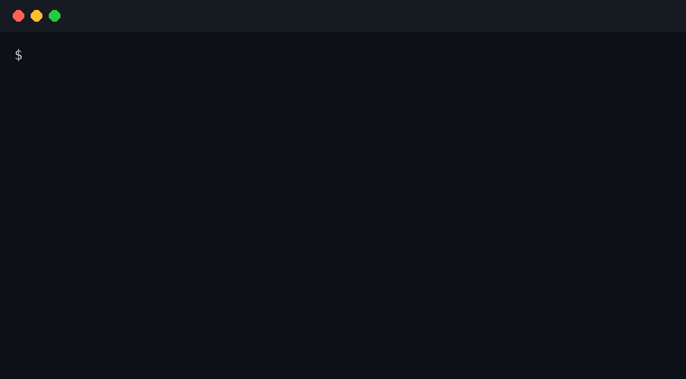

# Solaris Dev Shop


61 specialist employees and one chief of staff. Free. MIT.

You send a task. The chief of staff assigns exactly one accountable specialist. That specialist does the work. You still decide.

## Try it (30 seconds)

```bash
./install.sh
solaris-intake intake "Write a test plan for the client portal login regression"
```

That command routes the request. It names `solaris.qa-engineer` as accountable and performs no work of its own. The test plan itself is written by the qa-engineer, but only after you invoke that skill in your own agent. Routing is deterministic: the same request always lands on the same specialist. A saved run is in [`examples/route-a-task/`](examples/route-a-task/).



## What you get

| You get | Details |
|---|---|
| 61 employees | 12 departments: engineering, design, data, marketing, sales, leadership, and more. Full list: [`docs/employees.md`](docs/employees.md) |
| 1 chief of staff | Reads your request, emits one typed assignment packet: accountable owner, primary specialist, supporting list, authority bounds, evidence required |
| Deterministic router | Stdlib-only Python. 66 routing probes green in CI. No model calls, no API keys, no cost |
| Copy-paste skills | Each employee is a `SKILL.md` + `rules.md` + `plugin.json` + `capability.contract.json` + `learnings.md`. Drop one into any coding agent |
| QA loop built in | Every deliverable follows [`docs/QA-LOOP.md`](docs/QA-LOOP.md): build, independent review, fix, repeat until clean |

## How it compares

| | Solaris Dev Shop | Lone prompt | Agent marketplace listing |
|---|---|---|---|
| Who owns the task | One named specialist, accountable | Nobody | Varies by listing |
| Routing | Deterministic, tested, 61/61 reachable | Hope | Manual browsing |
| Cost to route | Zero (stdlib Python) | Per-call model cost | Platform fees |
| Skill portability | Copy a folder into your agent | Rewrite the prompt | Locked to the platform |
| QA | Independent review loop, no self-certification | Self-certified | Varies |

## Install

One command:

```bash
./install.sh
```

Details: [`docs/install.md`](docs/install.md). How a request moves: [`docs/architecture.md`](docs/architecture.md). How to copy a single skill: same doc, step 3.

## Contribute

- Found a routing miss? Open a [bug](.github/ISSUE_TEMPLATE/bug.md) with the command and the expected specialist.
- Want a new specialist? Open a [new employee proposal](.github/ISSUE_TEMPLATE/new-employee.md).
- Improving the router? `python3 tests/test_router.py` must stay green. CI runs it on every push.

## Contributors

[](https://github.com/Shaisolaris/solaris-dev-shop/graphs/contributors)

[](https://star-history.com/#Shaisolaris/solaris-dev-shop&Date)

## What this is not

- Not 73, 58, 52, or 100 employees. The count is 61 directories.
- Not the newer Solaris work. This is the public edition of V5.2.2.
- Not a marketplace or a patent filing.
- Not a place to paste passwords, API keys, or tokens.

## License

MIT. See [LICENSE](LICENSE) and [NOTICE.md](NOTICE.md).


