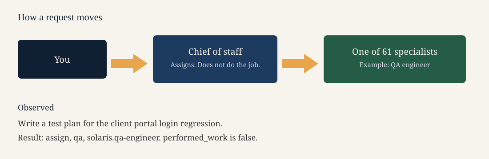

# Architecture



Three parts:

1. You send one request.
2. The chief of staff (`chief-of-staff/SKILL.md`) runs intake and emits one assignment. It does not do the specialist job.
3. One of the 61 employees does that job. You still confirm anything that spends money, deploys, or sends a message.

The intake command is:

```bash
python3 control-plane/meta_control_plane.py intake "Write a test plan for the client portal login regression"
```

On the run saved in `examples/route-a-task/`, that request was assigned to `solaris.qa-engineer`. The packet says `performed_work: false`.

The four files in `control-plane/` are companions so that command still runs. They are not a four-employee product.

Alfred stays out of this tree. A request the policy treats as personal health, personal finance, or travel escalates. It does not invent an Alfred employee here.
